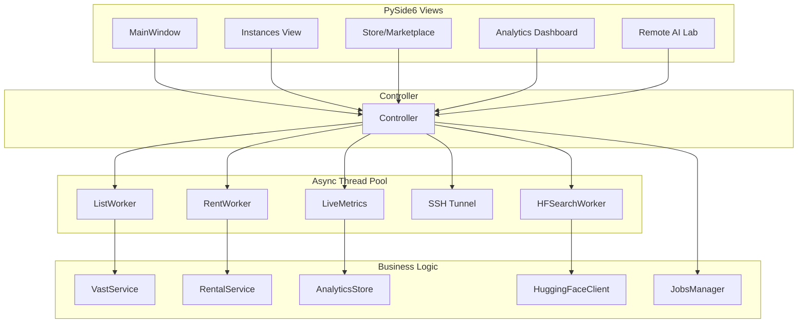

# Vast.ai Manager

A desktop application for managing **Vast.ai** infrastructure. Built with PySide6 and the official Vast.ai SDK, providing a low-latency interface for instance control, marketplace searching, and remote deployment.


> [!CAUTION]
> **Warning**: This project is currently in **Pre-Alpha**. It manages real cloud infrastructure and financial expenditures on Vast.ai. Use at your own risk. Features are evolving rapidly and may contain bugs or breaking changes.

---

## ⚡ Quick Start

```bash
# Clone and setup
git clone https://github.com/Haz4rdovisk/vast.ai-manager.git
cd vast.ai-manager && python -m venv .venv && .venv\Scripts\activate
pip install -r requirements.txt
python main.py
```

Then enter your [Vast.ai API Key](https://cloud.vast.ai/account/) in the **Settings** view.

---

## 🛠 Features

### 🖥 Instance Management
*   **Real-time Telemetry**: Monitor GPU/CPU load, System RAM, Disk, and Network traffic live.
*   **Thermal Monitoring**: Integrated tracking of hardware temperatures.
*   **Lifecycle Control**: Start, stop, reboot, and label instances directly.
*   **Native Terminal Integration**: Automatic SSH tunneling with one-click terminal launch.

### Instances Tab
The Instances tab provides a dense, multi-instance interface for power users:
- **Per-instance port allocator** — each tunnel gets its own local port, auto-incremented from `default_tunnel_port`.
- **Filters** — GPU type, status, label dropdowns plus sort selector; state persists across restarts.
- **Bulk operations** — Start/Stop actions on visible filtered instances with aggregate cost confirmation.
- **Action bar** — primary CTA plus icon buttons for reboot, snapshot, destroy, log, label, and Open Lab.

### 🛒 Marketplace & Rental
*   **Intelligent Search**: Unified discovery interface for GPU instances and Hugging Face model integration.
*   **Deep Filtering**: Filter by specific GPU models (H100, A100, 4090), VRAM capacity, and region-specific pricing.
*   **Smart Templates**: One-click deployment using community-optimized Docker templates with pre-configured environments.
*   **Workflow Presets**: Pre-defined filters for ML training, inference, and high-performance rendering.

### 📊 Analytics & Finance
*   **Balance Reconstruction**: Local synchronization of API usage data to build a high-fidelity historical balance timeline.
*   **Cycle Monitor**: Track remaining credits against projected consumption rates to prevent service interruptions.
*   **Spend Intelligence**: Detailed burn rate analysis across 24h, 7d, and 30d windows.
*   **Financial Transparency**: Integrated view of all invoices, deposits, and consumption spikes.

### 🧪 Remote AI Lab (Studio)
The AI Lab module transforms remote cloud instances into a private **LM Studio** environment:
*   **Discover**: An automated scoring engine ranks GGUF models against your remote instance's VRAM and CUDA capabilities.
*   **Automated Setup**: One-click provisioning of `llama.cpp` and optimized driver/environment configurations.
*   **Interactive Studio**: Embedded WebEngine chat interface for direct interaction with deployed LLMs.
*   **Diagnostic Resilience**: Real-time error monitoring with "One-Click Fix" banners for common remote setup hurdles.

---

## 🚀 Installation & Requirements

### Prerequisites
*   **OS**: Windows 10/11
*   **Python**: 3.10+
*   **OpenSSH**: Must be available in your system path.
*   **Terminal**: [Windows Terminal](https://aka.ms/terminal) is recommended.

### Setup
1.  **Clone & Setup**:
    ```bash
    git clone https://github.com/Haz4rdovisk/vast.ai-manager.git
    cd vast.ai-manager && python -m venv .venv && .venv\Scripts\activate
    pip install -r requirements.txt
    ```
2.  **Configuration**:
    *   Run `python main.py`.
    *   Enter your [Vast.ai API Key](https://cloud.vast.ai/account/) in the **Settings** view.
    *   Click **Test Connection** and save.

---

## 🏗 Architecture & Tech Stack

### System Architecture


### Project Structure
```
vastai-app/
├── app/
│   ├── ui/              # PySide6 views (MVC pattern)
│   ├── workers/         # Async background tasks (QThread-based)
│   ├── services/        # Business logic & API integration
│   ├── lab/             # Remote AI Lab module (Automation & Model Deployment)
│   │   ├── services/    # Hugging Face integration and Studio logic
│   │   ├── state/       # Lab-specific state management
│   │   ├── views/       # Discover, Studio, and Hardware views
│   │   └── workers/     # Setup, search, and remote probing tasks
│   ├── config.py        # Configuration store
│   └── theme.py         # Dark/light theme definitions & HSL tokens
├── tests/               # pytest suite
└── main.py              # Application entry point
```

---

## 📖 Usage Workflows

### 1. Rent and Deploy
1. Find a GPU in the **Store** and click **Rent**.
2. Once the instance is active, click the **Open Lab** icon.
3. Use **Discover** to pick a compatible GGUF model and click **Install**.
4. In the **Studio** tab, load the model and start chatting in the embedded UI.

### 2. Finance Monitoring
1. Check the **Analytics** view to see your real-time burn rate.
2. Use the **Cycle Tracker** to plan your next credit deposit based on historical consumption spikes.

---

## 🤝 Contributing
Contributions are welcome! Please follow the existing MVC pattern and HSL-based styling in `theme.py`.

---

## 📄 License
This project is licensed under the **MIT License**.

---

## 🙏 Acknowledgments
*   **Vast.ai Team** for the cloud API.
*   **Hugging Face** for the model ecosystem.
*   **llama.cpp community** for the inference orchestration.
