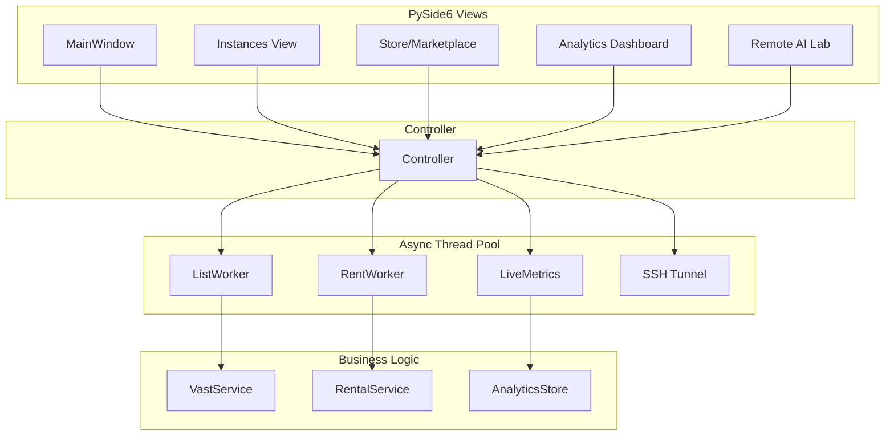

# Vast.ai Manager

A desktop application for managing **Vast.ai** infrastructure. Built with PySide6 and the official Vast.ai SDK, providing a low-latency interface for instance control, marketplace searching, and remote deployment.


> [!CAUTION]
> **Warning**: This project is currently in **Pre-Alpha**. It manages real cloud infrastructure and financial expenditures on Vast.ai. Use at your own risk. Features are evolving rapidly and may contain bugs or breaking changes.

---

## ⚡ Quick Start

```bash
# Clone and setup
git clone https://github.com/Haz4rdovisk/vast.ai-manager.git
cd vast.ai-manager && python -m venv .venv && .venv\Scripts\activate
pip install -r requirements.txt
python main.py
```

Then enter your [Vast.ai API Key](https://cloud.vast.ai/account/) in the **Settings** view.

---

## 🛠 Features

### 🖥 Instance Management
*   **Real-time Telemetry**: Monitor GPU/CPU load, System RAM, Disk, and Network traffic live.
*   **Thermal Monitoring**: Integrated tracking of hardware temperatures.
*   **Lifecycle Control**: Start, stop, reboot, and label instances directly.
*   **Native Terminal Integration**: Automatic SSH tunneling with one-click terminal launch.

### 🛒 Marketplace & Rental
*   **Advanced Search**: Deep filtering by GPU model (4090, A100, H100), VRAM, CPU architecture, and region.
*   **Workflow Presets**: Quick-filters for ML training, inference, and rendering.
*   **One-Click Deployment**: Automated rental using custom templates, Docker images, and SSH key injection.

### 📊 Analytics & Finance
*   **Spend Tracking**: Aggregated burn rates for 24h, 7 days, and 30 days.
*   **Cycle Monitor**: Track remaining balance against recharge frequency.
*   **Historical Timeline**: Visualized timeline of credit consumption and deposits.

### 🧪 Remote AI Lab
*   **Hardware Gauges**: Visual resource availability meters for GPU and System RAM.
*   **Automated Setup**: One-click scripts to install and configure `LLMfit` and `llama.cpp`.
*   **Model Advisor**: Integrated recommendation engine for GGUF model selection based on local hardware capacity.

---

## 🚀 Installation

### Requirements
*   **OS**: Windows 10/11
*   **Python**: 3.10 or higher
*   **OpenSSH Client**: Must be enabled in Windows Features (`Optional Features` → `OpenSSH Client`).
*   **Terminal**: [Windows Terminal](https://aka.ms/terminal) is recommended for the best SSH experience.

### Setup
1.  **Clone the repository**:
    ```bash
    git clone https://github.com/Haz4rdovisk/vast.ai-manager.git
    cd vast.ai-manager
    ```

2.  **Create a Virtual Environment**:
    ```bash
    python -m venv .venv
    .venv\Scripts\activate
    ```

3.  **Install Dependencies**:
    ```bash
    pip install -r requirements.txt
    ```

### Configuration
1.  Run the application: `python main.py`
2.  In the **Settings** view, enter your **Vast.ai API Key** from your [account page](https://cloud.vast.ai/account/).
3.  Click **Test Connection** to verify availability.
4.  Save and start managing your fleet.

---

## 🏗 Architecture & Tech Stack

### Core Technologies
*   **PySide6**: Qt6 framework for high-fidelity native UI with hardware-accelerated rendering.
*   **Vast.ai SDK**: Official Python client (`vastai>=0.3`) for cloud API integration.
*   **psutil**: Cross-platform system monitoring for local resource tracking.
*   **qtawesome**: Icon library for intuitive visual navigation.

### System Architecture
The application follows a **MVC (Model-View-Controller)** pattern with asynchronous worker threads:



### Project Structure
```
vastai-app/
├── app/
│   ├── ui/              # PySide6 views (MVC pattern)
│   │   ├── components/  # Reusable widgets (gauges, cards, forms)
│   │   └── views/       # Main application screens
│   ├── workers/         # Async background tasks (QThread-based)
│   ├── services/        # Business logic & API integration
│   ├── lab/             # Remote AI Lab module (LLMfit, llama.cpp automation)
│   │   ├── state/       # Application state management
│   │   ├── views/       # Lab-specific UI components
│   │   └── workers/     # Remote setup and probing tasks
│   ├── config.py        # Configuration store (API keys, preferences)
│   └── theme.py         # Dark/light theme definitions & stylesheets
├── tests/               # pytest suite with fixtures
├── docs/                # Technical documentation & design specs
└── main.py              # Application entry point
```

---

## 📖 Usage Examples

### Workflow 1: Rent a GPU in < 2 Minutes
1. Navigate to **Store** → Select preset "ML Training" or custom filter (e.g., RTX 4090, $0.15/hr)
2. Click **Rent** on desired offer → Configure template (Ubuntu 22.04 + Docker)
3. Wait for provisioning (~60s) → Instance appears in dashboard with live metrics

### Workflow 2: Monitor Costs & Set Alerts
1. Open **Analytics** view to see 24h/7d/30d burn rates
2. View "Cycle Monitor" to track remaining balance vs. recharge frequency
3. Historical timeline shows credit consumption spikes and deposits

### Workflow 3: Deploy LLM with One Click
1. Navigate to **Remote AI Lab** → Select active instance
2. Run **Automated Setup**: Installs `LLMfit` + `llama.cpp`
3. Use **Model Advisor** to select GGUF model based on available VRAM
4. Launch inference server accessible via SSH tunnel

---

## 🖼 Screenshots

*Coming soon: Dashboard with live gauges, Marketplace filtering interface, and Remote AI Lab setup wizard.*

---

## ❓ Troubleshooting

### SSH Terminal Fails to Open
**Cause**: OpenSSH Client not enabled in Windows.
**Fix**: 
1. Go to `Settings` → `Apps` → `Optional Features`
2. Click "Add a feature" → Search for **OpenSSH Client** → Install
3. Restart the application

### API Key Validation Fails
**Cause**: Invalid key or network timeout.
**Fix**:
1. Verify key at [Vast.ai Account](https://cloud.vast.ai/account/)
2. Check firewall/proxy settings blocking `api.vast.ai`
3. Ensure Python SSL certificates are up to date: `pip install --upgrade certifi`

### PySide6 Display Issues (Multi-Monitor)
**Cause**: DPI scaling mismatch.
**Fix**: Add before `QApplication` instantiation:
```python
import os
os.environ["QT_AUTO_SCREEN_SCALE_FACTOR"] = "1"
```

---

## 🤝 Contributing

Contributions are welcome! Please follow these guidelines:

### Development Setup
```bash
# Install dependencies
pip install -r requirements.txt

# Run tests
pytest tests/ -v

# Check code style (if configured)
ruff check .
```

### Guidelines
*   **Branch Naming**: `feature/description` or `fix/description`
*   **Commit Messages**: Conventional Commits format (`feat:`, `fix:`, `docs:`)
*   **Code Style**: Follow existing PEP 8 conventions in the codebase
*   **Testing**: Add tests for new features in `tests/` directory

### Areas Needing Help
*   Linux/macOS compatibility (currently Windows-only)
*   Additional GPU model presets in Marketplace
*   Enhanced analytics with export to CSV/PDF

---

## 📄 License

This project is licensed under the **MIT License** - see the [LICENSE](LICENSE) file for details.

---

## 🙏 Acknowledgments

*   **Vast.ai Team**: For providing the cloud infrastructure API and documentation.
*   **PySide6 Community**: Qt for Python bindings enabling native UI development.
*   **LLMfit Project**: Open-source LLM training framework integrated in Remote AI Lab.
