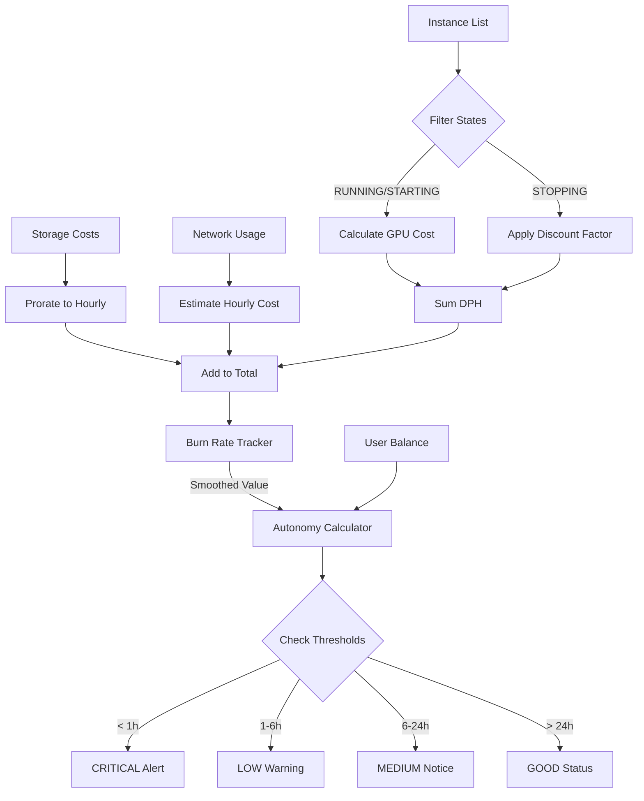

# Análise do Cálculo de Autonomia

## 1. Implementação Atual

### Funções Principais

#### [`burn_rate()`](app/billing.py:8)
```python
def burn_rate(instances: Iterable[Instance]) -> float:
    return round(sum(i.dph for i in instances if i.state == InstanceState.RUNNING), 4)
```
**Parâmetros utilizados:**
- `instances`: Lista de instâncias
- Filtro: Apenas instâncias com estado `RUNNING`
- Campo utilizado: `dph` (Dollars Per Hour - custo horário da GPU)

#### [`autonomy_hours()`](app/billing.py:12)
```python
def autonomy_hours(balance: float, burn: float) -> float | None:
    if burn <= 0:
        return None
    return balance / burn
```
**Parâmetros utilizados:**
- `balance`: Saldo atual da conta (float)
- `burn`: Taxa de consumo horário (resultado de `burn_rate()`)

### Fluxo de Cálculo
1. Filtra instâncias em estado `RUNNING`
2. Soma os valores de `dph` de todas as instâncias ativas
3. Divide o saldo pelo burn rate: `autonomia = balance / burn_rate`
4. Retorna `None` se não houver consumo (burn <= 0)

---

## 2. Limitações Identificadas

### 2.1 Custos Não Considerados
O cálculo atual considera **apenas** o custo da GPU (`dph`), ignorando:

| Campo no Modelo | Descrição | Impacto |
|-----------------|-----------|----------|
| `storage_total_cost` | Custo de armazenamento em disco | Pode ser significativo para instâncias longas |
| `inet_down_billed_gb` | Tráfego de download cobrado | Relevante para transferência de modelos grandes |
| `inet_up_billed_gb` | Tráfego de upload cobrado | Impacta ao fazer backup ou transferir dados |

### 2.2 Estados de Transição Não Tratados
- Instâncias em estado `STARTING` já consomem recursos mas não são contabilizadas
- Instâncias em estado `STOPPING` continuam consumindo até desligar completamente

### 2.3 Ausência de Suavização (Smoothing)
O cálculo usa o valor instantâneo de `dph`, que pode:
- Flutuar devido a preços dinâmicos do mercado Vast.ai
- Não refletir o custo médio real se houver variações bruscas

### 2.4 Falta de Thresholds de Alerta
Não há distinção visual ou lógica para níveis críticos de autonomia:
- Autonomia < 1 hora (crítico)
- Autonomia < 6 horas (alerta)
- Autonomia < 24 horas (atenção)

### 2.5 Precisão do Tempo
O cálculo retorna horas como float, mas não considera:
- Minutos e segundos para autonomia curta (< 1h)
- Dias para autonomia longa (> 24h)

---

## 3. Propostas de Melhoria

### 3.1 Cálculo Completo do Burn Rate

**Nova função:** `total_burn_rate()`
```python
def total_burn_rate(instances: Iterable[Instance], include_storage: bool = True) -> float:
    """
    Calcula o burn rate completo incluindo:
    - GPU (dph)
    - Armazenamento (storage_total_cost prorrateado por hora)
    - Tráfego de rede estimado
    """
```

**Fórmula proposta:**
```
total_burn = sum(dph) + 
             sum(storage_hourly_cost) + 
             estimated_network_cost_per_hour
```

### 3.2 Considerar Estados de Transição

Modificar o filtro para incluir:
```python
active_states = {InstanceState.RUNNING, InstanceState.STARTING}
# STOPPING pode ser incluído com um fator de desconto (ex: 50%)
```

### 3.3 Histórico e Suavização

Implementar `BurnRateTracker`:
- Manter histórico dos últimos N cálculos de burn rate
- Calcular média móvel para suavizar flutuações
- Detectar tendências (custo aumentando/diminuindo)

```python
class BurnRateTracker:
    def __init__(self, window_size: int = 10):
        self.history: deque[float] = deque(maxlen=window_size)
    
    def update(self, current_burn: float) -> float:
        """Retorna média móvel do burn rate"""
```

### 3.4 Níveis de Alerta de Autonomia

Adicionar enumeração e lógica de cores/alertas:
```python
class AutonomyLevel(Enum):
    CRITICAL = (0, 1)      # < 1 hora - Vermelho piscante
    LOW = (1, 6)           # 1-6 horas - Laranja
    MEDIUM = (6, 24)       # 6-24 horas - Amarelo
    GOOD = (24, float('inf'))  # > 24h - Verde
```

### 3.5 Formatação Inteligente do Tempo

Melhorar a exibição:
```python
def format_autonomy(hours: float) -> str:
    if hours is None or hours == float('inf'):
        return "∞"  # Infinito (sem consumo)
    elif hours < 1:
        minutes = int(hours * 60)
        return f"~{minutes}min"
    elif hours < 24:
        return f"~{hours:.0f}h"
    else:
        days = hours / 24
        return f"~{days:.1f}d" if days >= 1 else f"~{hours:.0f}h"
```

### 3.6 Projeção de Saldo

Adicionar função para projetar saldo futuro:
```python
def project_balance(balance: float, burn_rate: float, hours_ahead: int) -> float:
    """Projeta o saldo após N horas"""
    return max(0, balance - (burn_rate * hours_ahead))
```

### 3.7 Estimativa de Custo por Modelo AI

Para usuários que rodam LLMs, adicionar estimativa:
```python
def estimate_inference_cost(
    tokens_per_hour: int,
    cost_per_1k_tokens: float = 0.002  # Valor médio Vast.ai
) -> float:
    """Estima custo adicional de inferência (se aplicável)"""
```

---

## 4. Diagrama de Arquitetura Proposto



---

## 5. Plano de Implementação Sugerido

### Fase 1: Correções Imediatas (Baixo Esforço)
- [ ] Adicionar formatação inteligente do tempo (minutos/dias)
- [ ] Implementar níveis de alerta com cores
- [ ] Incluir estado STARTING no cálculo

### Fase 2: Cálculo Completo (Médio Esforço)
- [ ] Adicionar storage_total_cost ao burn rate
- [ ] Criar BurnRateTracker para suavização
- [ ] Adicionar projeção de saldo futuro

### Fase 3: Recursos Avançados (Alto Esforço)
- [ ] Estimativa de custo de rede baseada em histórico
- [ ] Alertas proativos (notificações quando autonomia < threshold)
- [ ] Gráfico de projeção de autonomia ao longo do tempo

---

## 6. Considerações sobre Vast.ai API

**Observação importante:** O campo `dph` já inclui o custo da GPU, mas:
1. **Storage**: Cobrado separadamente quando excede a cota gratuita (geralmente ~50GB)
2. **Network**: Download é gratuito na maioria dos casos, upload pode ser cobrado
3. **Preços Dinâmicos**: O `dph` pode mudar durante o tempo de execução se o mercado flutuar

**Recomendação:** Verificar a documentação atual da API Vast.ai para confirmar quais custos estão inclusos no `dph` e quais são cobrados à parte.
